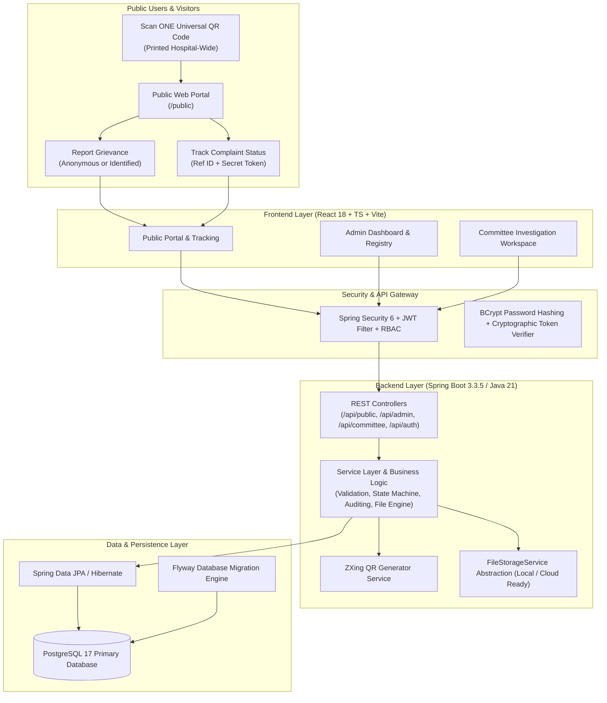
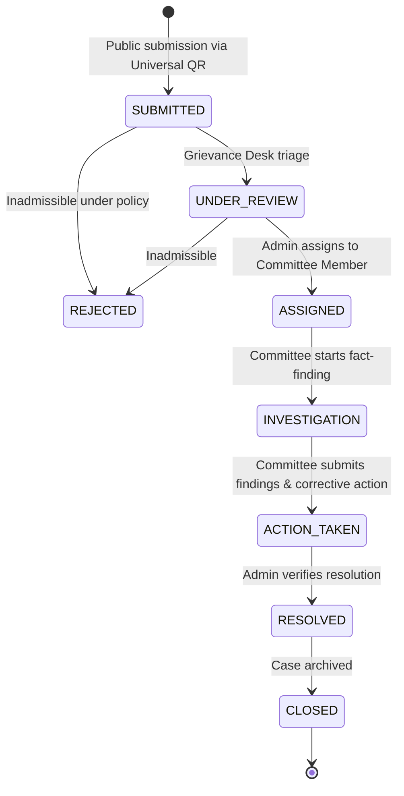

# Hospital Grievance & Accountability Management System — Architecture

## 1. Executive Summary

The **Hospital Grievance & Accountability Management System** is an institutional full-stack software platform engineered to provide patients, visitors, and hospital staff with a transparent, confidential, and prompt mechanism to report and resolve hospital service deficiencies, misconduct, or malpractice.

Unlike conventional feedback forms, this system implements a strict **Legal & Administrative Allegation Lifecycle**, enforcing separation of concerns between complainant reports, impartial committee fact-finding, and verified administrative corrective actions.

---

## 2. High-Level System Architecture

---

## 3. Core Architectural Principles

### 3.1. The ONE Universal QR Code Architecture
- **Single QR Code Rule:** Exactly **ONE** universal QR code is deployed across the entire hospital campus (Reception, OPD, Pharmacy, Billing, Emergency bays, and Inpatient Wards).
- **No Fragmented QR Codes:** Visitors are never required to search for department-specific barcodes.
- **Location Selection:** Upon scanning, the public portal dynamically provides a curated dropdown of hospital departments and wards.
- **Dynamic Reconfigurability:** Hospital administrators can regenerate the QR code or update the underlying target URL anytime without modifying application code.

### 3.2. Public Anonymity & Cryptographic Tracking
- **Zero Friction Submission:** Public visitors are **never** forced to create an account, register, or provide a password.
- **Anonymity Guarantee:** Users can toggle 100% anonymous submission. Personal identifiers (name, phone, email) are omitted entirely from database persistence.
- **Secure Token Verification:** Upon submission, the user receives:
  1. A human-readable Complaint Reference (`HGS-YYYY-NNNNNN`).
  2. A 16-character cryptographic tracking token.
- **Zero Raw Token Storage:** The database stores only a salted **SHA-256 hash** of the tracking token. Tracking attempts require both the reference number and the raw token to match the computed hash.
- **Sanitized Public Responses:** The public tracking API strips all internal committee notes, staff usernames, audit logs, and confidential investigation attachments.

### 3.3. Fair Allegation & Safety Doctrine
- **Presumption of Good Faith:** Submissions are treated as reported allegations until formally investigated.
- **Emergency Safety Boundary:** The platform prominently displays an emergency disclaimer across all public screens, directing acute clinical danger to official 24x7 emergency and trauma hotlines rather than treating the grievance form as a dispatcher.

---

## 4. Complaint State Machine & Workflow

### Transition Rules:
| Initial Status | Allowed Transitions | Transition Enforcers |
| :--- | :--- | :--- |
| `SUBMITTED` | `UNDER_REVIEW`, `ASSIGNED`, `REJECTED` | Administrator / System |
| `UNDER_REVIEW` | `ASSIGNED`, `INVESTIGATION`, `REJECTED` | Administrator |
| `ASSIGNED` | `INVESTIGATION`, `UNDER_REVIEW`, `ACTION_TAKEN`, `REJECTED` | Administrator / Committee |
| `INVESTIGATION`| `ACTION_TAKEN`, `ASSIGNED`, `RESOLVED`, `REJECTED` | Committee / Administrator |
| `ACTION_TAKEN` | `RESOLVED`, `INVESTIGATION`, `CLOSED` | Administrator |
| `RESOLVED`     | `CLOSED`, `ACTION_TAKEN`, `UNDER_REVIEW` | Administrator |
| `REJECTED`     | `UNDER_REVIEW` (Re-open by Admin only) | Administrator |
| `CLOSED`       | `UNDER_REVIEW` (Re-open by Admin only) | Administrator |

---

## 5. Security & Role-Based Access Control (RBAC)

1. **Authentication:**
   - Stateless JWT tokens signed with HMAC-SHA256.
   - User passwords hashed using `BCryptPasswordEncoder` (cost factor 10).
2. **Roles:**
   - `ROLE_ADMIN`: Full administrative visibility, user account management, master data maintenance, QR regeneration, complaint assignment, priority override, and CSV data export.
   - `ROLE_COMMITTEE_MEMBER`: Scoped access strictly limited to complaints assigned to the authenticated member. Can record inquiry summaries, verified findings, corrective actions, and upload inquiry evidence.
3. **Audit System:**
   - Every status alteration, priority change, user creation/toggle, login attempt, and QR generation writes an immutable row into `audit_logs` capturing operator ID, action type, entity ID, previous value, new value, and client IP address.

---

## 6. File Storage Engine

- **Abstraction:** `FileStorageService` defines a generic contract for storing, fetching, validating, and deleting evidence attachments.
- **Local Implementation:** `LocalFileStorageServiceImpl` safely stores files in configurable directory `./uploads`.
- **Hardened Validation:**
  - Strict file extension allowlist: `.jpg`, `.jpeg`, `.png`, `.pdf`.
  - Max file size enforcement (10MB).
  - Directory traversal prevention (`..` sanitization).
  - Random UUID file renaming to prevent collisions and execution attacks.
