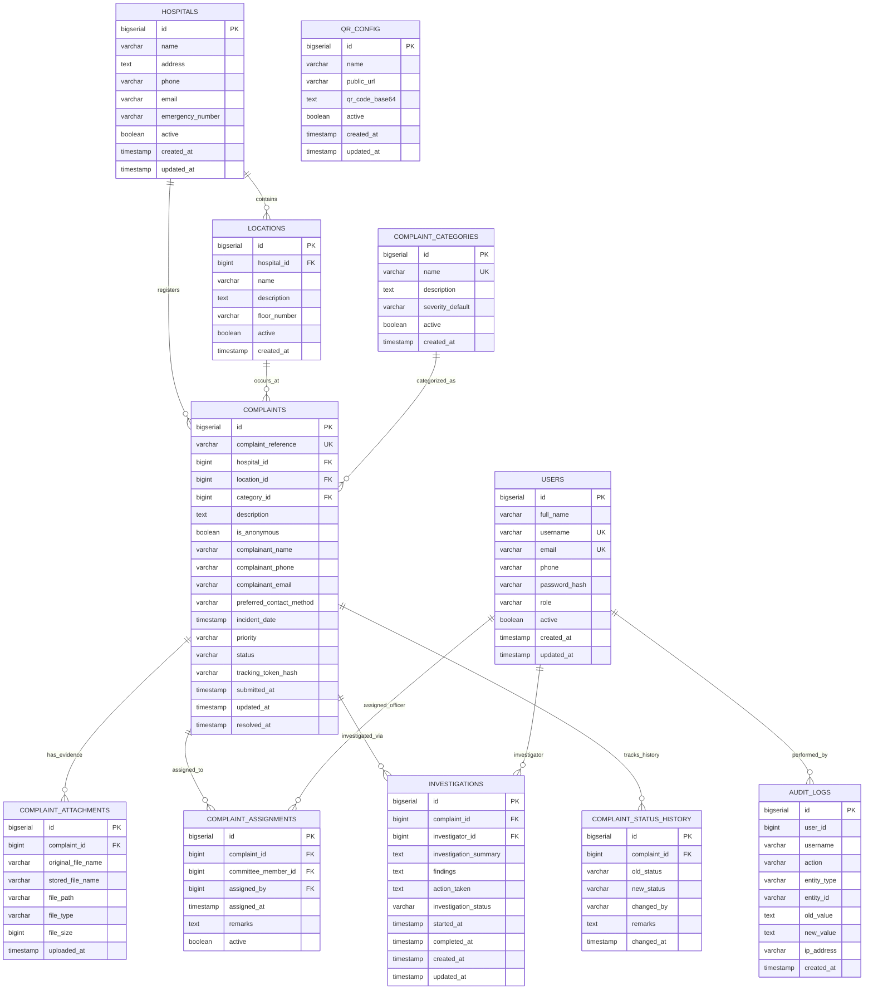

# PostgreSQL 17 Database Schema & Entity Relationships

The **Hospital Grievance & Accountability Management System** utilizes a normalized relational PostgreSQL 17 database schema managed via **Flyway Versioned Database Migrations**.

---

## 1. Entity Relationship Overview

---

## 2. Table Specifications & Indexes

### 2.1. `users`
- Stores administrators and committee investigators.
- Unique indexes on `username` and `email`.
- Index on `role`.

### 2.2. `complaints`
- Primary aggregate root representing grievance submissions.
- Unique index on `complaint_reference` (`HGS-YYYY-NNNNNN`).
- B-Tree indexes on `status`, `priority`, `category_id`, `location_id`, and `submitted_at` for high-throughput multi-criteria filtering.

### 2.3. `investigations`
- Stores findings and corrective action details submitted by assigned committee members.
- Foreign keys to `complaints` (cascade on delete) and `users`.

### 2.4. `audit_logs`
- Append-only compliance log.
- Indexes on `action`, `created_at`, and `(entity_type, entity_id)` for audit trail queries.

---

## 3. Flyway Migration Inventory

| Version | Migration Script | Purpose |
| :--- | :--- | :--- |
| `V1` | `V1__create_users.sql` | Creates staff and committee user table with unique indexes |
| `V2` | `V2__create_hospitals.sql` | Creates hospital organization profile table |
| `V3` | `V3__create_locations.sql` | Creates hospital department and floor location table |
| `V4` | `V4__create_categories.sql` | Creates complaint classifications & severity presets |
| `V5` | `V5__create_complaints.sql` | Creates primary complaints table with reference & token hash |
| `V6` | `V6__create_attachments.sql` | Creates supporting evidence file attachment table |
| `V7` | `V7__create_assignments.sql` | Creates committee member assignment history |
| `V8` | `V8__create_investigations.sql` | Creates inquiry findings & corrective action table |
| `V9` | `V9__create_status_history.sql` | Creates complaint state transition history log |
| `V10`| `V10__create_audit_logs.sql` | Creates compliance audit trail table |
| `V11`| `V11__create_qr_config.sql` | Creates ONE Universal QR code and settings tables |
| `V12`| `V12__seed_initial_data.sql` | Seeds hospital, 12 departments, 13 categories, & settings |
